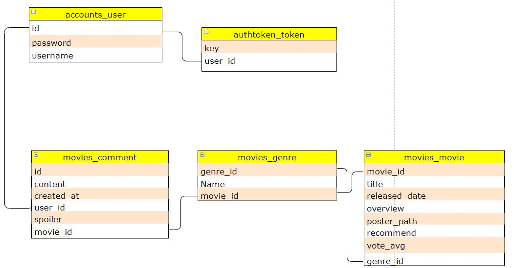
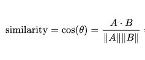
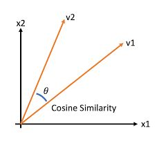

# Final-PJT
---
## 팀원 정보 및 업무 분담 내역

## 목표 서비스 구현 및 실제 구현 정도
	LoginView(완료)
		○ Username, password를 장고(서버)로 보내주고 dj-rest-auth 인증과정을 거침
		○ 로그인에 성공하면 mainview로 이동
		
	SignUpView(완료)
		○ Username, password1, password2를 장고(서버)로 보내주고 dj-rest-auth 인증과정을 거침
		○ 회원가입에 성공하면 mainview로 이동

	MainView (완료)
		MovieList 
			§ Mainview의 하위 컴포넌트
			§ 인기영화의 포스터, 제목을 나열
			§ 개별 영화를 클릭하면 MovieDetailView로 이동
		MovieDetailView
			§ MovieList의 하위 컴포넌트
			§ 영화의 줄거리, 예고편(Youtube API) 평점 등 세부정보 표시
		Genre
		Recommend
		Comment

	Genre (완료)
		○ MovieDetailView의 하위 컴포넌트
		○ 개별 영화의 장르를 표시
		○ 장르 버튼을 클릭하면 해당 장르의 영화 목록 표시
		○ 영화를 클릭하면 그 영화의 MovieDetailView로 이동
	
	Recommend (완료)
		○ MovieDetailView 하위 컴포넌트
		○ TMDB API 를 통해 영화별 줄거리 데이터 저장
		○ TFIDF, 코사인 유사도를 활용해 줄거리가 유사한 상위 10개 영화 추천
		○ 영화를 클릭하면 그 영화의 MovieDetailView로 이동
		
	Comment (완료)
		○ MovieDetailView의 하위 컴포넌트
		○ 스포일러 유무를 결정하는 버튼 추가
		○ 스포일러가 있는 댓글을 확인하기 위해선 버튼 클릭 필요
		
	
	ProfileView (미완료)
		○ 유저의 개별정보를 확인하는 부분
          ○ 개별정보를 수정할 수도 있음
	

## 데이터베이스 모델링 (ERD)

## 영화 추천 알고리즘에 대한 기술적 설명
	
## Tf-idf
전체 문서 내에서 특정 단어가 얼마나 사용되었는지를 판별
Ex) 조사, 접미사 같은 경우 모든 문서에 걸쳐 자주 사용되기 때문에 낮은 가중치, 몇 번 나오지 않은 단어에는 높은 가중치 부여

## 코사인 유사도
두 벡터의 내적 값이 높을 수록(줄거리에 쓰인 단어가 유사할 수록) 높은 갚이 출력

TF-IDF 와 코사인 유사도를 이용해 줄거리 유사도 점수가 높은 상위 영화 10개 목록 호출

## 서비스 대표 기능에 대한 설명
### 장르별 영화 목록
-    영화 별로 장르 리스트를 받아오기
-    장르 버튼을 클릭하면 해당하는 장르의 영화 목록 호출
### 스포일러 방지 댓글
-    스포일러 댓글을 작성할 때 버튼을 클릭하도록 설정
-    스포일러가 있는 댓글을 확인하려면 버튼을 클릭하도록 설정

## 프로젝트 후기

## 1일차
    프로젝트가 시작되고, 페어와 같이 설계부터 시작하였습니다. 먼저 영화 리스트 목록을 불러와 장고 DB에 저장하는 작업을 페어가 하였고, 저는 백엔드 작업으로 불러온 데이터를 프론트와 연동하기 이전에 Vue에서 기능들을 추가해 놓았습니다. 
    
    아직 장고에서 데이터를 받아오지 않았기 때문에 TMDB API를 통해 실시간 데이터를 불러와 각 영화 페이지 별로 띄우는 기능과 '맨 처음 페이지로 가기'와 '맨 마지막 페이지로 가기' 기능을 구현하였습니다.

## 2일차 
     프론트엔드에서 백엔드 DB에 저장된 영화 데이터를 불러오는 작업을 통해 실시간으로 불러오던 것을 DB에서 불러오도록 변경하였고, 앞서 구현했던 '페이지 이동'버튼과도 연동하였습니다. 또한, 영화 세부정보를 볼 수 있는 Detail페이지도 View에 추가하여 Main페이지에서 영화 하나를 클릭하였을 때 Detail페이지로 이동하도록 구현하였습니다.

     Detail 페이지에서는 단일 영화에 대한 정보와 영화 예고편을 보여주도록 구현하였습니다. 영화 예고편은 TMDB API에서 불러온 데이터 중 Youtube 예고편과 관련된 데이터를 통해 해당 예고편 중 첫번째(0번) 예고편을 불러왔습니다.

## 3일차
     앞서 1일차에 구현했던 페이지 이동 버튼의 오류를 수정하였습니다. 이전에는 1 페이지에서 앞으로 가기 버튼을 누르면 innerText가 -6 즉, 0이하의 값이 되는 오류를 수정하여 1 페이지 이하(혹은 마지막페이지)로 innerText가 변경되지 않도록 수정하였습니다. 

## 4일차 
     TMDB api로 예고편을 불러오는 것에서 Youtube API를 통해 불러오도록 변경하였습니다. TMDB로 불러오는 경우에는 예고편이 없는 영화도 존재했기에 Youtube로 변경하였습니다. 또한, Detail page도 조금 수정하여 fade-in / fade-out 효과를 주었습니다.

## 5일차
     메인 페이지에서 사이드바(메뉴)를 추가하여 나중에 영화 장르별 페이지로 이동하기 위한 초석을 다졌습니다. 